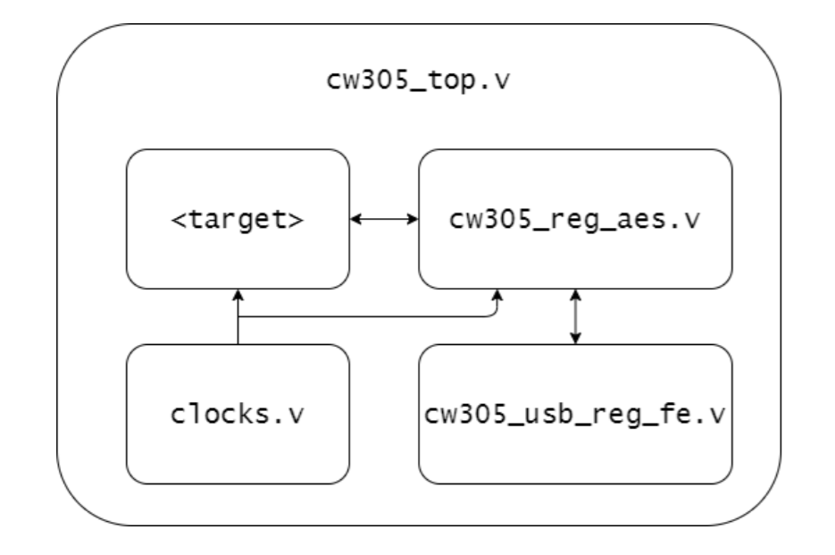

# CW305 fpga wrapper
readme file that describes the blocks of the CW305 wrapper taking as example the AES crypto target  

## CW305-AES-standalone

The target is an AES hardware accelerator implemented as a 1-round per cycle, it is memory mapped and its register file is driven by the SAM3U microcontroller via parallel USB interface. It is synthesized on the CW305 board which mounts a Artix-7 FPGA (*part number : xc7a35tftg256-2*)  

The top level wrapper is defined in `cw305_top.v`, it is is composed of : 

- `cw305_usb_reg_fe.v` : front end interface with SAM3U processor for the USB connection. The FPGA interfaces with SAM3U through an 8-bit data bus and a 21-bit address bus (14 msb register identifier + 7 lsb count offset, therefore each register is 128 bytes wide). 
	note : if FPGA has not enough BRAM to implement the register file, the register width can be adjusted the `pBYTECNT_SIZE` verilog parameter ( and consequently the `bytecount` size property in file `cw305.py` in software).    
	
- `clocks.v` : implements two clocks domain
	- USB clock domain, fix to 96 MHz, which drive the control and status register (the ones  written/read by software). It is disabled when collecting the power traces since it's a source of noise.  
	- Cryptographic clock, provided to the crypto target which can be configured to wanted frequency

- `cw305_reg_aes.v`: AES register interface, contains the control and status registers which can are used to drive AES and interface with software (via USB). It contains a clock-domain-crossing logic to go from the USB clock to the crytpo target clock. 
  The registers address are defined in `cw305_aes_defines.v`, to launch the target application write to `REG_CRYPT_GO` register. When the application finishes it writes to this register to signal completion. 
  
- `crypto target` : in this case is the AES hardware accelerator (`aes_core.v`) implemented as a 1 round per cycle  

The constraint file to synthesize in **Vivado** is `cw305.xdc`
